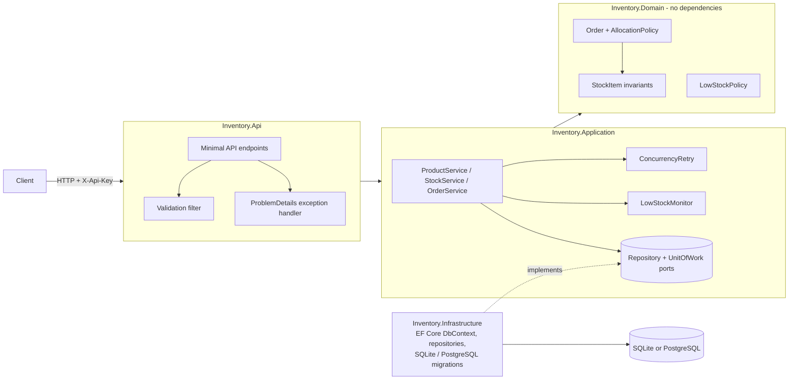

# stockroom

A warehouse inventory REST API that reserves, fulfils and cancels orders without overselling stock, with automatic low-stock alerts.

[](https://github.com/srujanmalakpata/stockroom/actions/workflows/ci.yml)
[](LICENSE)
[](Directory.Build.props)
[](global.json)

## Highlights

- **99 passing tests; 94.7% Release line coverage** in the recorded Linux run, spanning domain,
  application and HTTP integration tests ([verification, rows 4–5](VERIFICATION.md)).
- **All-or-nothing reservations:** allocation is planned before any stock mutation;
  `Place_WhenAnyLineIsShort_ReservesNothing` guards this guarantee ([OrderTests](tests/Inventory.Domain.Tests/OrderTests.cs)).
- **Oversell protection under contention:** 12 simultaneous orders requesting 3 units each against
  10 units produce exactly 3 successful orders; concurrency tokens and fresh-state retries enforce it
  ([ConcurrencyTests](tests/Inventory.Api.IntegrationTests/ConcurrencyTests.cs), [verification, rows 9–10](VERIFICATION.md)).
- **Low-stock write-skew protection:** a product-level token serialises decisions across different
  bins, backed by `EveryEvaluation_BumpsProductVersion_SoConcurrentEvaluationsConflict` and a partial
  unique index for open alerts ([verification, row 12](VERIFICATION.md)).
- **Two real database providers:** separate SQLite and PostgreSQL migrations, with the same 44
  integration tests passing on PostgreSQL in 5 repeated Linux runs; a non-root Docker image and
  Azure Bicep complete the packaging ([verification, rows 8–9 and 15–21](VERIFICATION.md)).

**Tech stack:** C# 12 · .NET 8 Minimal APIs · EF Core 8 · SQLite / PostgreSQL 16 · FluentValidation ·
xUnit / Coverlet · OpenAPI · Docker · Azure Bicep · GitHub Actions.

**Validation:** measurements above come from the recorded Linux run. Local checks and environment
limits are documented in [VERIFICATION.md](VERIFICATION.md). Azure infrastructure was compiled and
linted only; it has never been deployed. The project has no production users.

## Quickstart

Requirements: Git, curl and the .NET 8 SDK (`global.json` requires 8.0.400 or a later .NET 8 feature band).

```bash
git clone https://github.com/srujanmalakpata/stockroom.git
cd stockroom
dotnet restore --locked-mode
dotnet run --project src/Inventory.Api
```

The launch profile selects Development on **http://localhost:5000**, applies SQLite migrations and
loads the development API key. Open **http://localhost:5000/swagger** to explore the API. In a second
terminal, create a product:

```bash
curl -i http://localhost:5000/api/products \
  -H 'X-Api-Key: dev-only-key-not-a-secret' -H 'Content-Type: application/json' \
  -d '{"sku":"widget-1","name":"Widget","reorderThreshold":5}'
```

Example **201 Created** response (the generated `id` varies):

```json
{
  "id": "c238bb20-2a46-46df-8069-446f0ca04d21",
  "sku": "WIDGET-1",
  "name": "Widget",
  "reorderThreshold": 5,
  "onHand": 0,
  "reserved": 0,
  "available": 0,
  "isLowStock": true,
  "locations": []
}
```

A product with no stock and a positive threshold immediately raises a low-stock alert. Repeating the
same SKU returns **409 `duplicate_sku`**. SQLite data is kept in `src/Inventory.Api/inventory.db`.

## Contents

[Architecture](#architecture) · [Features](#features) · [Usage](#usage) · [API](#api) ·
[Testing](#testing) · [Measured results](#results-measured) · [Limitations](#limitations) · [License](#license)

## Architecture



Dependencies point inward. Domain references nothing. Application references Domain and defines the
persistence interfaces. Infrastructure implements them with EF Core. Api composes everything.

```
POST /api/orders ─► ValidationFilter ─► OrderService.PlaceAsync ─► ConcurrencyRetry
     ├─ load products + all StockItems for them (fulfil/cancel read the stock before the order)
     ├─ Order.Place(...)  → AllocationPolicy plans every line, then StockItem.Reserve(...)
     ├─ LowStockMonitor.EvaluateAsync(...)  → bump Product.Version, maybe stage a LowStockAlert
     └─ UnitOfWork.SaveChanges → UPDATE StockItems / Products ... WHERE Id=@id AND Version=@old
            0 rows, or a racing insert on a unique index?
            → ConcurrencyConflictException → discard tracked state, retry from the top
```

Design tradeoffs and provider details are documented in [DESIGN.md](DESIGN.md).

## Features

- **Domain rules in the domain layer**: `StockItem` enforces `0 <= Reserved <= OnHand` on every
  mutation and caps one location at 100,000,000 units (totals across locations are `long`, so nothing
  can overflow). `Order.Place` plans the allocation for every line before it reserves anything, so the
  order is all-or-nothing. Fulfilled and cancelled orders are terminal. Database CHECK constraints back
  up the same invariant.
- **Order lifecycle**: place (reserve, split across locations largest-first), fulfil (ship reserved
  units), cancel (release them).
- **Low-stock alerts**: an alert is raised when total available units fall below a product's reorder
  threshold (including a brand-new product with no stock), at most one open alert per product
  (enforced by a partial unique index). It resolves automatically when stock recovers. An alert
  records `availableAtRaise` and `thresholdAtRaise` as snapshots: changing the threshold later does not
  rewrite an open alert.
- **Concurrency**: `StockItem`, `Order` and `Product` rows each carry a `Version` concurrency token.
  The product's token is bumped by every stock change for that product, so two requests that touch
  *different* locations of one product cannot both decide on an alert from a stale total (write skew).
  Conflicting writes fail at commit, races on the unique indexes for a new bin or the one open alert
  are treated the same way, and the operation is retried against fresh data with jittered back-off.
- **EF Core + two providers**: SQLite for local, dev and tests, and PostgreSQL (Npgsql, with
  `EnableRetryOnFailure` for transient connection errors) selected by `Database:Provider`. Each
  provider has its own migration history.
- **HTTP**: Minimal APIs, FluentValidation (400 `ValidationProblemDetails`, `code: validation_failed`),
  RFC 9457 `ProblemDetails` with a stable `code` and a W3C `traceId` (the id the logs and Application
  Insights use) for every error response, including ones that never throw (`bad_request` for
  unreadable JSON, `unauthorized`, `not_found` for unknown routes). Each domain error declares whether
  it is bad input (400) or a state conflict (409). A client that disconnects mid-request is logged at
  Debug level, not reported as a 500. OpenAPI/Swagger UI marks only write operations as needing the
  key. Every list endpoint is paged: `offset` below 0 becomes 0 and `limit` is clamped to 1-100 (so
  `limit=0` returns one item) rather than rejected. `/health/live` and `/health/ready` (database
  check), and structured JSON logs with HTTP request logging.
- **Timestamps** are stored as UTC with whole milliseconds, so a write response and later reads of the
  same row return the same instant on both SQLite (0.1 ms precision) and PostgreSQL (1 µs).
- **Auth**: an `X-Api-Key` authentication handler (constant-time comparison) protects all write
  endpoints. Read endpoints are anonymous. The only committed key is an obvious development
  placeholder in `appsettings.Development.json`. Production keys come from Key Vault.
- **Ops**: a multi-stage Dockerfile that runs as the non-root `app` user, Azure Bicep for App Service
  (Linux), PostgreSQL Flexible Server, Key Vault references through a user-assigned identity and
  Application Insights, and GitHub Actions CI with locked NuGet restore and caching, format, build,
  migration-drift check, tests plus coverage, a PostgreSQL job, a Docker job and a Bicep job. There is
  no deployment stage.

## Usage

Receive stock and place an order (in the second terminal; replace `PRODUCT_ID` with the returned id):

```bash
KEY='dev-only-key-not-a-secret'
URL=http://localhost:5000
PRODUCT_ID='<id>'
curl -s -X POST "$URL/api/products/$PRODUCT_ID/stock/receipts" -H "X-Api-Key: $KEY" -H 'Content-Type: application/json' \
  -d '{"locationCode":"A-01","quantity":8}'
curl -s -X POST "$URL/api/orders" -H "X-Api-Key: $KEY" -H 'Content-Type: application/json' \
  -d "{\"customerReference\":\"C-1\",\"lines\":[{\"productId\":\"$PRODUCT_ID\",\"quantity\":5}]}"
```

PostgreSQL instead of SQLite:

```bash
Database__Provider=Postgres \
ConnectionStrings__Inventory='Host=localhost;Database=inventory;Username=postgres;Password=...' \
dotnet run --project src/Inventory.Api
```

Docker:

```bash
docker build -t stockroom .
docker run -p 8080:8080 -e Database__MigrateOnStartup=true -e Auth__ApiKeys__0="$(openssl rand -hex 24)" stockroom
```

New migration (one per provider; restore the local EF tool first):

```bash
dotnet tool restore
dotnet ef migrations add MigrationName --project src/Inventory.Infrastructure --startup-project src/Inventory.Infrastructure \
  --context SqliteInventoryDbContext --output-dir Persistence/Migrations/Sqlite
dotnet ef migrations add MigrationName --project src/Inventory.Infrastructure --startup-project src/Inventory.Infrastructure \
  --context PostgresInventoryDbContext --output-dir Persistence/Migrations/Postgres
```

## API

| Method | Path | Auth | Purpose |
| --- | --- | --- | --- |
| GET | `/api/products?offset&limit` | – | Products with on-hand / reserved / available totals |
| GET | `/api/products/{id}` | – | One product with stock per location |
| POST | `/api/products` | key | Create product (`sku`, `name`, `reorderThreshold`) |
| PUT | `/api/products/{id}/reorder-threshold` | key | Change low-stock threshold |
| POST | `/api/products/{id}/stock/receipts` | key | Receive units into a location |
| POST | `/api/products/{id}/stock/counts` | key | Cycle count of a known bin (set on-hand; rejected below reserved; unknown bin → 404) |
| GET | `/api/stock?location=A-01&offset&limit` | – | Stock levels, optionally for one location |
| POST | `/api/orders` | key | Place order; 409 `insufficient_stock` if any line can't be filled |
| GET | `/api/orders/{id}` | – | Order with its reservations |
| POST | `/api/orders/{id}/fulfil` | key | Ship reserved stock |
| POST | `/api/orders/{id}/cancel` | key | Release reserved stock |
| GET | `/api/alerts/low-stock?includeResolved=false&offset&limit` | – | Low-stock alerts, newest first |
| GET | `/health/live`, `/health/ready` | – | Liveness / readiness (DB) |

Swagger UI is at `/swagger` (enabled in Development, or with `OpenApi__Enabled=true`).

## Testing

```bash
dotnet format --verify-no-changes
dotnet build -warnaserror
dotnet test --settings coverlet.runsettings --collect:"XPlat Code Coverage"

# Same integration tests against PostgreSQL (any reachable server; a database per test class is created and dropped):
INVENTORY_TEST_POSTGRES='Host=localhost;Port=5432;Username=postgres;Password=postgres' \
  dotnet test tests/Inventory.Api.IntegrationTests
```

- `tests/Inventory.Domain.Tests`: xUnit unit tests for the invariants, capacity and overflow limits,
  allocation and order lifecycle.
- `tests/Inventory.Application.Tests`: the retry loop, the low-stock monitor and response totals
  above `int` range, using fakes.
- `tests/Inventory.Api.IntegrationTests`: `WebApplicationFactory` hosts the real app against a
  private SQLite in-memory database with real migrations. It covers auth, validation, ProblemDetails,
  the order lifecycle, alerts, health and OpenAPI, plus the concurrency tests:
  - two simultaneous 7-unit orders against 10 units: exactly one succeeds and the other gets 409
    `insufficient_stock`.
  - 12 simultaneous 3-unit orders against 10 units: exactly 3 succeed and nothing is oversold.
  - two units of work that read the same row: the second commit is rejected by the concurrency token.
  - simultaneous fulfil and cancel of one order (10 iterations): exactly one wins, the other gets 409
    `invalid_order_state`, and stock ends consistent.
  - an exhausted retry budget (a unit of work that always conflicts, 3 attempts): 409
    `concurrency_conflict` and nothing written.
  - simultaneous cycle counts at two locations of one product (10 iterations × 2 scenarios): both
    succeed and exactly one alert is open (the write-skew regression).
  - five simultaneous first receipts into the same new bin: all succeed and add up.
  - `ModelTests`: the `Version` columns are concurrency tokens on both providers. The migration-drift
    check cannot see this, because a token changes the UPDATE SQL, not the schema.
  - regression tests: `lines:[null]` gives 400 (it was a 500), timestamps in a 201 equal the
    later GET, `traceId` is a W3C trace id, and domain errors map to 400/409 by their declared kind.

## Results (measured)

Shared 4-vCPU Linux container (Ubuntu 24.04), .NET SDK 8.0.425, 2026-10-03. Full details are in
[VERIFICATION.md](VERIFICATION.md).

| What | Result |
| --- | --- |
| Tests | 99 passed, 0 failed (48 domain + 7 application + 44 integration), Debug and Release |
| Line / branch coverage, Release (the CI configuration; EF migrations excluded) | 94.7 % (725/765 lines) / 74.7 % (92/123 branches). Debug measures 95.1 % / 75.6 % |
| Integration suite on PostgreSQL 16.15 (Docker) | 44/44 passed, in 5 of 5 repeated runs |
| Concurrency tests, SQLite, retries on | 10 of 10 repeated runs passed |
| Same tests with retries **disabled** (`MaxAttempts=1`) | the suite failed in 10 of 10 runs with `concurrency_conflict`. The two-request test alone failed in 6 of 10 (4 and 5 of 10 in separate measurements; it varies), which shows the requests really overlap and the tokens catch them |
| Write-skew controls with the product-token bump removed | the unit test `EveryEvaluation_BumpsProductVersion_...` fails every time. The HTTP regression test is probabilistic: it failed in 10/10, 5/5 and 9/10 runs across three separate measurements |
| Fulfil-vs-cancel test with order read before stock | failed in 1 to 4 of 5 runs, depending on timing (`reservation_mismatch` instead of `invalid_order_state`); passes with the fix |
| `dotnet build -warnaserror` | 0 warnings, 0 errors (analyzers at `latest-recommended`) |
| `bicep build` + `bicep lint` (CLI 0.37.4) | 0 errors, 0 warnings, 12 resources |
| Docker image | Build and container smoke tests: NOT_RUN in the recorded test environment (see VERIFICATION.md). A separate smoke test passed as uid 1654 (`app`). The recorded 112.7 MB is containerd *compressed* content size; unpacked image size is not measured |

## Limitations

- The project has no users and no production deployment.
- Concurrency results come from in-process tests with simultaneous HTTP requests; this is not a load
  test and no throughput numbers are claimed.
- The restricted macOS verification environment denies local socket binds and `getdomainname`.
  Tests and HTTP smoke checks are blocked before assertions; formatting, Release compilation and
  both migration-drift checks pass. The passing integration results above are specific to Linux;
  see [VERIFICATION.md](VERIFICATION.md#2026-10-03-local-verification).
- Application Insights export via OpenTelemetry (`UseAzureMonitor`) is configured behind a connection
  string but was never exercised.
- **Not deployed.** The Bicep template was compiled and linted offline only. No Azure resources were
  created, and the App Service and PostgreSQL settings have never been exercised in Azure.
- The PostgreSQL firewall rule allows Azure services. A production setup would use VNet integration
  and private access. The app also connects as the server's admin login; a least-privileged
  application role is the next step.
- The API-key scheme is all-or-nothing: one scope, no per-client identity. JWT bearer with Entra ID
  would be the next step for real users.
- Reads are anonymous and list endpoints load stock for one page of products. There is no caching,
  search or rate limiting.
- Retries make contention survivable, not free. Under heavy contention on one SKU, requests can
  exhaust `Concurrency:MaxAttempts` and get 409 `concurrency_conflict`, which tells the client to retry.
- The product-level token serialises *all* stock writes for one product, even at different
  locations. That is what makes alert decisions correct, but it caps write throughput per SKU.
- Product totals in responses are `long`, but `LowStockAlert.AvailableAtRaise` stays `int`. That is
  safe because an alert is only raised when the total is below an `int` threshold.
- Partial fulfilment, backorders, returns, transfers between locations and multi-warehouse routing
  are out of scope.

## License

MIT. See [LICENSE](LICENSE).
